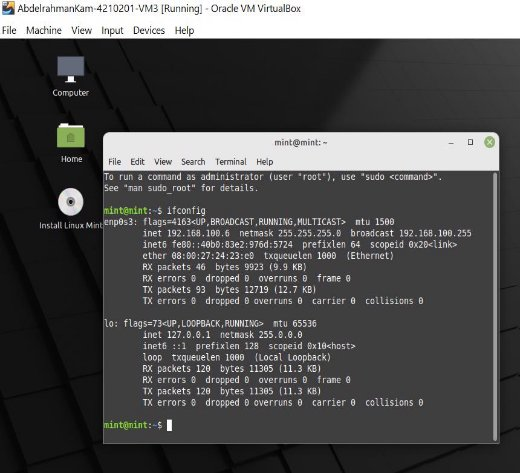

# Multiple-VM-Client-Server-Socket-communication 

### This socket program consists of 1 Server virtual machine and two client VMs.
- It allows you to send and receive customized messages  by the user from each client to the server and vice versa.

- Messages sent and received appear as a simple chat app between the client and the server. The code is attached in two files server.py and client.py. 

## Table of Contents: 

1- VM Setup Steps. 

2- Code Execution 

3- The Result Demonstration 

## VM Setup Steps  

### 1- 

### 2- 

### 3- 

### 4- 

### 5- 

## Making 3 Virtual Machines 1 Server 2 clients 

##  Creating a NAT Network from host preferences 

## Connecting the Virtual Machines to the NAT Network

##  VM 1 is a Server with ip:192.168.100.4 

## VM2,3 are Clients with ip: 192.168.100.5 , 192.168.100.6

# The Result Demonstration 

